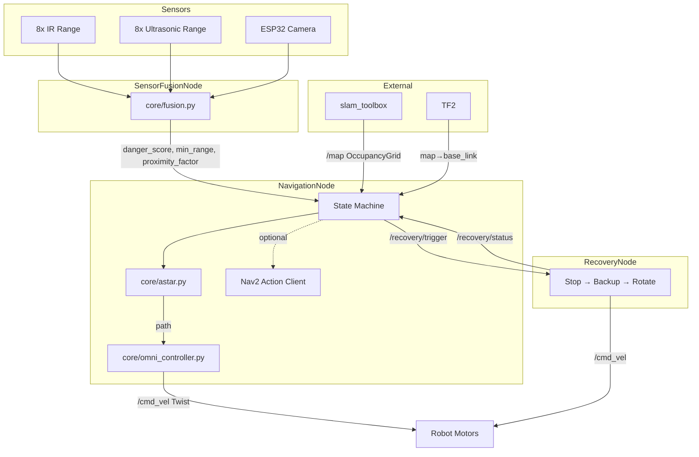

# Autonomous-Navigation-Robot
A complete ROS 2 navigation stack for an omnidirectional indoor robot, implemented as 14 Python source files + 1 YAML config across 5 directories.

## 🚧 Project Status

This project is currently in the development phase.  
The README outlines the planned architecture and algorithms, while implementation is ongoing.

Some sections (e.g., RL, MPC) represent planned or experimental components.

## Project Structure

```
Welcome Robot Project/
├── config.py                          # All tuneable parameters
├── config/
│   └── slam_toolbox_params.yaml       # SLAM configuration
├── core/
│   ├── __init__.py
│   ├── astar.py                       # A* global planner
│   ├── omni_controller.py             # Holonomic pure pursuit
│   └── fusion.py                      # Sensor fusion logic
├── launch/
│   └── navigation_launch.py           # ROS 2 launch file
├── nodes/
│   ├── __init__.py
│   ├── navigation_node.py             # Main brain (state machine)
│   ├── sensor_fusion_node.py          # Raw sensor → fused output
│   └── recovery_node.py              # Stuck handling
└── utils/
    ├── __init__.py
    ├── geometry.py                    # Math helpers
    ├── grid.py                        # OccupancyGrid utilities
    └── path.py                        # Path pruning/smoothing
```

## Architecture



## Key Design Decisions

### 1. Layered Architecture
Code is split into three dependency layers (`utils → core → nodes`) where each layer only imports downward. This makes the algorithmic code (`core/`) unit-testable without a ROS runtime.

### 2. A* with Safety Features
- **8-connected** grid search with octile heuristic (admissible).
- **Corner-cutting prevention**: diagonal moves blocked if either adjacent cardinal cell is occupied.
- **Timeout guard**: returns `None` after 5 seconds to prevent the control loop from hanging.
- **Obstacle inflation**: binary dilation by robot radius so A* treats the robot as a point.

### 3. Holonomic Pure Pursuit
Standard Regulated Pure Pursuit adapted for omni-drive:
- Outputs `linear.x` (forward), `linear.y` (lateral), and `angular.z` (yaw).
- **Approach scaling**: speed tapers near the goal to prevent overshoot.
- **Proximity regulation**: speed multiplier from sensor fusion scales velocity down near obstacles.

### 4. Sensor Fusion (8 IR + 8 US + Camera)
- Each sensor type has individual subscribers (one per physical sensor).
- Camera uses Canny edge density in the bottom half of the frame as an obstacle proximity proxy.
- Weighted combination → danger score (0–1) and proximity factor (1 = clear, 0 = stop).

### 5. State Machine with Recovery
```
IDLE → PLANNING → FOLLOWING → GOAL_REACHED
              ↘ RECOVERY ↗
```
- **Replanning** triggers on: path blocked, cross-track error > 0.4m, danger spike.
- **Recovery sequence**: stop → backup → rotate → report status.
- **Cooldown**: 2-second minimum between replans to avoid thrashing.

### 6. Nav2 Action Client
Included as an optional path: `send_nav2_goal()` can hand off navigation to the full Nav2 stack. Gracefully degrades if `nav2_msgs` is not installed.

## How to Launch

```bash
# From the project root:
ros2 launch launch/navigation_launch.py

# Or run nodes individually:
python3 nodes/sensor_fusion_node.py
python3 nodes/navigation_node.py
python3 nodes/recovery_node.py
```

## Send a Goal

```bash
ros2 topic pub --once /goal_pose geometry_msgs/PoseStamped \
  "{header: {frame_id: 'map'}, pose: {position: {x: 2.0, y: 1.5, z: 0.0}}}"
```

## Verification

All 14 Python files pass AST syntax validation.

## Configuration Reference

All parameters live in [config.py](file:///d:/Welcome%20Robot%20Project/config.py). Key groups:

| Group | File | Notable Parameters |
|---|---|---|
| Robot | `config.py` | `MAX_LINEAR_SPEED=0.35`, `ROBOT_RADIUS=0.18` |
| Planner | `config.py` | `OBSTACLE_THRESHOLD=65`, `INFLATION_RADIUS_CELLS=4` |
| Controller | `config.py` | `LOOKAHEAD_DISTANCE=0.30`, `GOAL_TOLERANCE=0.08` |
| Fusion | `config.py` | `IR_WEIGHT=0.35`, `US_WEIGHT=0.40`, `CAM_WEIGHT=0.25` |
| Recovery | `config.py` | `MAX_RECOVERY_ATTEMPTS=3` |
| SLAM | `slam_toolbox_params.yaml` | `resolution=0.05`, `do_loop_closing=true` |

## Current Status

This project is currently in the early development phase. The software architecture and core navigation logic are being implemented using ROS 2 and Python, while hardware components are still being finalized. The system is designed modularly to support future integration of sensors and motor control using NanoClaw. Simulation and real-world testing will follow after initial implementation is complete.
