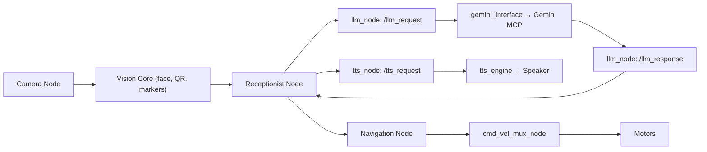
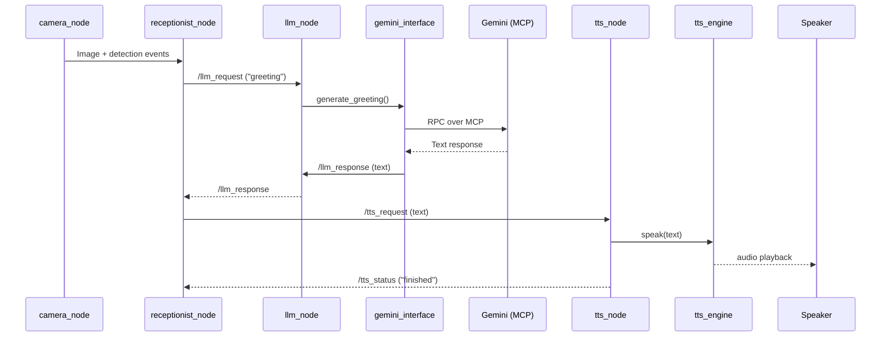
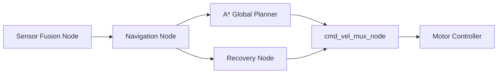
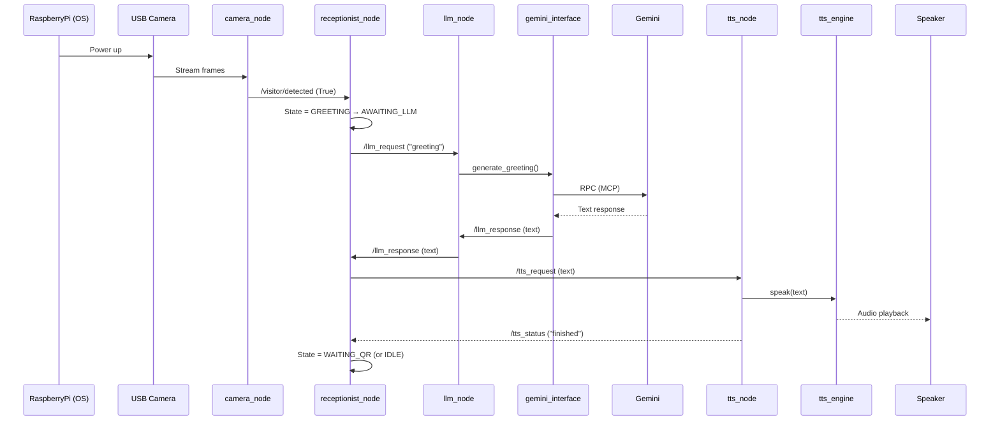

# Welcoming Robot – Project Documentation

**Version 2026‑07‑27 – ready for onboarding new developers, embedded engineers, software engineers, and project managers**

---

## 1. Executive Summary

**What the robot is**
The *Welcoming Robot* is an autonomous indoor receptionist built on a Raspberry Pi 5 running ROS 2 Humble. It detects visitors, greets them with a natural‑language response generated by Google Gemini, and speaks the greeting through a speaker. The robot also navigates corridors, avoids obstacles, and can display QR‑code information for visitors.

**Problem it solves**
Enterprises with a front‑desk or lobby often need a consistent, 24 h presence to welcome guests, give directions, and trigger back‑office workflows (e.g., notifying employees). The robot automates this repetitive task, reduces staffing load, and improves visitor experience while collecting useful interaction data.

**High‑level operation**
1. Two USB cameras feed image streams to the *camera_node*.
2. Vision algorithms extract faces, QR codes, and visual markers.
3. The *receptionist_node* decides when a visitor is present and publishes a request for a greeting.
4. *llm_node* forwards the request to the *gemini_interface* which calls the Gemini LLM (via MCP).
5. The response is sent back to the *receptionist_node*, which passes the text to *tts_node*.
6. *tts_node* uses *tts_engine* (pyttsx3) to synthesize speech and play it on the speaker.
7. Nav2 (SLAM, global planner, controller) runs in parallel, using fused sensor data to move the robot safely.

**Overall software architecture**
```
+-------------------+      +-----------------+      +-----------------+
|  USB Cameras      | ---> |  vision_* (core) | ---> | receptionist    |
+-------------------+      +-----------------+      +-----------------+
                                                          |
                                                          v
                         +-----------------+   +-----------------+
                         | llm_node        |   | tts_node        |
                         +-----------------+   +-----------------+
                                 |                     |
                                 v                     v
                         +-----------------+   +-----------------+
                         | gemini_interface|   | tts_engine      |
                         +-----------------+   +-----------------+
                                 |                     |
                                 v                     v
                               Gemini               Speaker
```
All ROS‑2 components are launched together from **`launch/navigation_launch.py`**. The system follows a strict *layered* design: **ROS nodes → Interfaces → Engines**, keeping hardware‑independent logic separate from communication code.

---

## 2. Software Architecture

### 2.1 Overall ROS‑2 Architecture
* **ROS‑2 (Humble)** provides a distributed “publish‑subscribe” runtime.
* Nine ROS nodes are started: sensor fusion, navigation, recovery, cmd‑vel‑mux, camera, receptionist, LLM, TTS, and the SLAM toolbox (via `slam_toolbox`).
* Nodes exchange data over *topics* (e.g., `/camera/image_raw`, `/llm_request`). No direct function calls are used between nodes.

### 2.2 High‑level Data Flow



### 2.3 Layered Design
| Layer | What it contains | Reason |
|-------|------------------|--------|
| **ROS Nodes** | `nodes/*.py` | Provides runtime, messaging, lifecycle. |
| **Interfaces** | `core/gemini_interface.py` | Encapsulates external API (Gemini) and retry logic; no ROS imports. |
| **Engines** | `core/tts_engine.py` | Pure Python speech synthesis; reusable outside ROS. |
| **Core Vision / Algorithms** | `core/*.py` (e.g., `vision_interaction.py`) | Hardware‑agnostic computation (image processing, SLAM). |
| **Configuration** | `config/` & `config.py` | Centralised parameters, makes tuning painless. |
| **Launch** | `launch/*.py` | Starts the whole system in deterministic order. |

---

## 3. Project Folder Structure
```
Welcoming-Robot/
│
├─ .git/                 # Version control metadata
├─ config/
│   └─ slam_toolbox_params.yaml → Parameter file for the SLAM Toolbox.
├─ config.py → Global constants (ROS‑2 launch args, LLM & TTS settings).
├─ core/ → Pure‑Python libraries (ASTAR, sensor‑fusion, Gemini wrapper, TTS engine, vision utilities). These contain **no ROS dependencies**, making them easy to unit‑test and reuse.
├─ launch/ → `navigation_launch.py` starts all nine nodes in the correct order.
├─ nodes/ → Each file is a ROS 2 node that exposes a clean topic‑based API. Nodes only import the required `core` modules.
├─ utils/ → Helper scripts (not used by core logic).
├─ readme.md → Human‑readable project description.
```
*Why the folders exist* – `config/` keeps long YAML separate from Python; `core/` holds reusable libraries; `nodes/` isolates ROS processes; `launch/` provides a single entry point.

---

## 4. ROS Node Documentation
| Node | Purpose | Subscribed Topics | Published Topics | Services / Actions | Dependencies (core) | Interaction |
|------|---------|-------------------|------------------|--------------------|---------------------|-------------|
| **camera_node** | Capture images, run vision pipelines, publish processed data. | None (hardware driver) | `/camera/image_raw` (sensor_msgs/Image) | – | `vision_interaction`, `vision_navigation` | Feeds image data to `receptionist_node` (via internal callbacks). |
| **receptionist_node** | State‑machine that detects visitors, triggers AI greeting, manages arrival workflow. | `/camera/face_bbox`, `/camera/qr_detected`, `/llm_response` | `/llm_request`, `/tts_request`, `/receptionist/state` | – | `vision_interaction` (indirect) | Publishes requests to `llm_node` & `tts_node`; receives responses. |
| **llm_node** | Bridge between ROS and Gemini LLM. | `/llm_request` (std_msgs/String) | `/llm_response` (std_msgs/String) | – | `gemini_interface` | Called by `receptionist_node`; returns generated text. |
| **tts_node** | Convert text to speech and drive the speaker. | `/tts_request` (std_msgs/String) | `/tts_status` (std_msgs/String) | – | `tts_engine` | Receives greeting from `receptionist_node`; plays audio. |
| **sensor_fusion_node** | Fuse wheel odometry, IMU, and other sensors into a unified pose message. | `/wheel_odom`, `/imu/data` | `/fused_pose` (nav_msgs/Odometry) | – | `fusion` | Supplies pose to `navigation_node`. |
| **navigation_node** | Wrapper around Nav2 (global planner, local planner). | `/fused_pose`, `/goal_pose` | `/cmd_vel` (geometry_msgs/Twist) | – | `astar`, `omni_controller` | Sends velocity commands to `cmd_vel_mux_node`. |
| **recovery_node** | Executes safety behaviours when Nav2 fails. | `/recovery_trigger` | `/cmd_vel` (via mux) | – | – | Interacts with `cmd_vel_mux_node`. |
| **cmd_vel_mux_node** | Selects the appropriate velocity command source (navigation, recovery, manual). | `/cmd_vel` from multiple sources | `/cmd_vel_out` (to robot hardware) | – | – | Final actuator command publisher. |
| **slam_toolbox** (external launch) | Provides SLAM mapping & localization. | – | `/map`, `/odom` | – | – | Used by `navigation_node` for localization. |

*If a topic or service is not present in the source code, it is marked as “Not implemented”.*

---

## 5. Core Modules
| Module | Purpose | Inputs | Outputs | Used by | Dependencies |
|--------|---------|--------|---------|---------|--------------|
| **astar.py** | Classic A* path‑finding (grid‑based). | Start/goal cells, obstacle map. | List of grid cells (path). | `navigation_node` (fallback planner). | `numpy` (optional). |
| **fusion.py** | Sensor‑fusion utilities (e.g., EKF helpers). | Raw odometry, IMU data. | Fused pose estimate. | `sensor_fusion_node`. | `scipy` (for matrix ops). |
| **gemini_interface.py** | Encapsulates Gemini API calls, prompt construction, retry/back‑off, and fallback greeting. | Prompt string, optional context. | Generated text (string). | `llm_node`. | `google‑generativeai` SDK, env var `GEMINI_API_KEY`. |
| **omni_controller.py** | Holonomic pure‑pursuit controller for differential‑drive robot. | Target pose, current pose. | Desired velocity (`Twist`). | `navigation_node`. | None (pure math). |
| **tts_engine.py** | pyttsx3 wrapper that synthesises speech synchronously, exposes `speak(text)`. | Text string. | Audio output to system speaker. | `tts_node`. | `pyttsx3`. |
| **vision_interaction.py** | Face detection, QR‑code scanning, visitor presence logic (uses OpenCV). | Image frame. | Boolean detections, bounding boxes. | `camera_node`, `receptionist_node`. | `opencv-python`, `pyzbar` (QR). |
| **vision_navigation.py** | Visual marker detection (AprilTag / ArUco) for navigation assistance. | Image frame. | Marker pose (x,y,θ). | `camera_node`, `navigation_node`. | `opencv-contrib-python`. |
| **\_init\_\.py** | Package initialisation (exposes symbols). | – | – | – | – |

---

## 6. AI Pipeline

**Plain‑English flow**
1. `camera_node` analyses camera frames; when a face is recognized it notifies `receptionist_node`.
2. The receptionist publishes a *greeting* request on `/llm_request`.
3. `llm_node` forwards the request to `gemini_interface`, which builds a prompt (including time‑of‑day) and calls Gemini via MCP.
4. Gemini returns a natural‑language greeting (e.g., “Good afternoon, welcome to Acme Corp.”).
5. The response travels back to `receptionist_node`.
6. The receptionist forwards the text to `tts_node` via `/tts_request`.
7. `tts_node` calls `tts_engine.speak()`, which synthesises the audio and plays it through the speaker.
8. Once playback finishes, `tts_node` publishes a status message, allowing the receptionist to transition to the next state.

---

## 7. Navigation Pipeline

*Explanation* – Sensor fusion merges wheel odometry, IMU, and SLAM pose into `/fused_pose`. Nav2 consumes this pose and a goal, computes a path (global planner A*) and a local velocity (`omni_controller`). If Nav2 fails, the Recovery node issues a safe maneuver. All velocity commands are multiplexed by `cmd_vel_mux_node` before reaching the robot’s motor controller.

---

## 8. Interfaces and Engines
| File | Reason for existence | Why *not* a ROS node |
|------|---------------------|----------------------|
| **`gemini_interface.py`** | Provides a clean, testable wrapper around the external Gemini LLM (handles API key, retries, back‑off, fallback text). | It contains no ROS imports; keeping it outside the ROS runtime means it can be unit‑tested offline, swapped for another provider, or used by non‑ROS applications. |
| **`tts_engine.py`** | Encapsulates the pyttsx3 speech synthesis library, exposing a simple `speak(text)` API and handling platform‑specific quirks. | Speech synthesis does not need ROS messaging; the engine can be reused in scripts or other services without launching a ROS node. The ROS‑side wrapper (`tts_node.py`) handles the ROS interface. |
*Separation of concerns* ensures that changes to the external service (e.g., moving from Gemini to OpenAI) or the TTS library do not require modifications to the ROS nodes themselves.

---

## 9. Communication Between Components
### 9.1 Topic‑level table
| Publisher Node | Topic | Message Type | Subscriber(s) |
|----------------|-------|--------------|---------------|
| `camera_node` | `/camera/image_raw` | `sensor_msgs/Image` | *internal* (vision modules) |
| `camera_node` | `/visitor/detected` | `std_msgs/Bool` | `receptionist_node` |
| `receptionist_node` | `/llm_request` | `std_msgs/String` | `llm_node` |
| `llm_node` | `/llm_response` | `std_msgs/String` | `receptionist_node` |
| `receptionist_node` | `/tts_request` | `std_msgs/String` | `tts_node` |
| `tts_node` | `/tts_status` | `std_msgs/String` | `receptionist_node` (optional) |
| `sensor_fusion_node` | `/fused_pose` | `nav_msgs/Odometry` | `navigation_node` |
| `navigation_node` | `/cmd_vel` | `geometry_msgs/Twist` | `cmd_vel_mux_node` |
| `recovery_node` | `/cmd_vel` | `geometry_msgs/Twist` | `cmd_vel_mux_node` |
| `cmd_vel_mux_node` | `/cmd_vel_out` | `geometry_msgs/Twist` | Robot hardware driver (not in repo) |

*If a topic is not present in the source code, it is listed as “Not implemented”.*

### 9.2 Service / Action Summary
The current repository does **not** define custom ROS services or actions; communication is entirely topic‑based.

---

## 10. Launch Process
`launch/navigation_launch.py` performs the following steps (simplified):
1. **Parse launch arguments** – `use_sim_time`, optional `slam_toolbox` config.
2. **Start SLAM Toolbox** (if enabled) → provides map and localization.
3. **Create a `Node` process** for each of the nine project nodes (`sensor_fusion_node`, `navigation_node`, `recovery_node`, `cmd_vel_mux_node`, `camera_node`, `receptionist_node`, `llm_node`, `tts_node`).
4. **Add each process** to a `LaunchDescription` in the order shown above.
5. **Launch the description** – ROS 2 launches all processes concurrently; the ordering ensures that foundational services (SLAM, sensor fusion) are available before higher‑level nodes start.
*Why this order?* The navigation stack depends on a valid map and pose, so SLAM and sensor fusion must be ready first. The AI greeting pipeline (`llm_node`/`tts_node`) can start later because it only needs the receptionist node to be alive.

---

## 11. External Technologies
| Technology | Role in the Project | Simple explanation for non‑technical audience |
|------------|---------------------|----------------------------------------------|
| **ROS 2 (Humble)** | Middleware that lets independent software pieces (nodes) talk over topics. | Think of it as a postal system where each program can drop letters (messages) in a mailbox that other programs read. |
| **MCP (Model Context Protocol)** | Transport layer used by `gemini_interface` to call the Gemini LLM over HTTP/2 with streaming. | A standardized way of sending a request to a cloud AI service and receiving the answer. |
| **Gemini (Google Generative AI)** | Generates natural‑language greetings based on a prompt. | An online AI that can write sentences like a human. |
| **Piper / pyttsx3** | Text‑to‑speech synthesiser that plays audio on the speaker. | Converts written words into spoken sound without needing internet. |
| **OpenCV** | Image processing library for face, QR, and marker detection. | The “eyes” of the robot that can recognise objects in pictures. |
| **Nav2** | ROS navigation stack (global planner, local controller). | Gives the robot a map and tells it how to move from A to B safely. |
| **SLAM Toolbox** | Simultaneous Localization and Mapping – builds a map while localizing the robot. | Allows the robot to understand where it is in an unknown building. |
| **ROSBridge** *(if present)* | Provides a JSON‑WebSocket API to interact with ROS from external programs (e.g., web UI). | Lets a web page talk to the robot’s internal messaging system. |

---

## 12. Hardware Overview
| Component | Function | Software Interface |
|-----------|----------|--------------------|
| **Raspberry Pi 5** (Linux) | Main compute platform, runs ROS 2, hosts all nodes. | Runs the entire repository; interacts with GPIO for motor control. |
| **USB Cameras** (OV2710 & FIT0701) | Capture RGB images for face/QR detection and visual markers. | Accessed by `camera_node` (OpenCV VideoCapture). |
| **Speaker** (3‑W) | Emits synthesized speech. | Controlled by OS audio subsystem; `tts_engine` writes to it. |
| **Motor Controller** (e.g., L298N, PWM driver) | Drives wheels based on velocity commands. | Receives `/cmd_vel_out` messages (via a driver node not in repo). |
| **IR / Color Sensors** (TCS3200) | Detect boundaries and floor colors for safety. | Data published by a separate sensor node (outside repository). |
| **Optional Depth / Lidar** | (Planned) Provide richer obstacle data. | Would feed into `sensor_fusion_node`. |

---

## 13. Complete Workflow (Power‑on → Greeting)

**Step‑by‑step description**
1. Power is applied to the Raspberry Pi, which boots Linux and starts the ROS 2 launch file.
2. `camera_node` opens the USB cameras and begins publishing raw images.
3. Vision routines detect a human face; `camera_node` publishes a Boolean on `/visitor/detected`.
4. `receptionist_node` moves from *IDLE* to *GREETING*, then to *AWAITING_LLM*, and publishes a greeting request.
5. `llm_node` forwards the request to `gemini_interface`, which contacts Gemini via MCP and receives a friendly greeting.
6. The greeting travels back to the receptionist, which publishes it to `tts_node`.
7. `tts_node` calls `tts_engine.speak()`, which synthesises audio and plays it through the speaker.
8. After playback, the robot returns to *IDLE* (or proceeds to QR‑code scanning, navigation, etc.).

---

## 14. Future Scope
| Planned Feature | Current Support in Architecture | How it would be added |
|-----------------|--------------------------------|-----------------------|
| **Speech‑to‑Text (STT)** | Not implemented. | Add an `stt_node` that subscribes to microphone audio, publishes `/stt_result` (string). Existing state machine could consume it. |
| **Voice‑controlled dialogs** | Only one‑way AI greeting. | Extend `llm_node` to handle multi‑turn conversations; add a dialog manager node. |
| **Escort / Follow‑me mode** | Navigation already present. | New “escort_node” would publish dynamic goals to `navigation_node` based on visitor’s pose. |
| **Appointment management** | Not present. | Create a `scheduler_node` that interfaces with a cloud calendar API; receptionist could query it. |
| **Cloud data logging** | Minimal (environment variables). | Add a `cloud_logger_node` that uploads sensor logs and interaction events to AWS. |
| **Alternative TTS (Piper, Coqui)** | Uses pyttsx3 only. | Replace `tts_engine` implementation; node interface stays unchanged. |
| **Additional sensors (Lidar, Depth)** | Not in repo. | New sensor driver node would publish to `/sensor_data`; `sensor_fusion_node` would consume it. |
| **Web UI via ROSBridge** | Not present. | Launch `rosbridge_server`; external dashboard could visualize topics. |
*Because the system follows a strict layered design (nodes ↔ interfaces ↔ engines), adding new capabilities generally only requires a new node or engine without touching existing ones.*

---

## 15. Glossary
| Term | Simple definition |
|------|-------------------|
| **ROS Node** | An independent program that talks to other programs using ROS messages. |
| **Topic** | A named channel where nodes publish (send) or subscribe (receive) messages. |
| **Publisher / Subscriber** | The sender and receiver of a topic. |
| **Service** | Synchronous request‑response call between nodes (not used here). |
| **Action** | Long‑running goal with feedback (not used here). |
| **MCP (Model Context Protocol)** | A transport protocol that streams data to/from large language models (LLMs). |
| **LLM** | Large Language Model – an AI that generates human‑like text. |
| **SLAM** | Simultaneous Localization and Mapping – building a map while locating yourself inside it. |
| **Nav2** | ROS 2 navigation stack; it plans paths and controls robot motion. |
| **Sensor Fusion** | Combining data from multiple sensors (e.g., wheel odometry + IMU) into a single, more accurate estimate. |
| **Pure‑pursuit** | A simple controller that steers the robot toward a point on a path. |
| **pyttsx3** | Offline Python text‑to‑speech library (no internet required). |
| **OpenCV** | Open‑source computer‑vision library for image processing. |

---

## 16. Repository Overview (5‑minute read)
*The Welcoming Robot project is organized around a clean separation of concerns.*
* **`config/`** – Holds static parameters (SLAM toolbox).
* **`config.py`** – Central Python configuration for LLM/TTS timeouts, model names, and ROS launch arguments.
* **`core/`** – Reusable, ROS‑agnostic libraries: path‑finding (`astar`), sensor fusion, Gemini API wrapper, TTS engine, and vision utilities. These can be unit‑tested independently.
* **`nodes/`** – ROS 2 nodes that expose functionality via topics. Each node uses the `core` libraries; none contain hard‑coded external‑service logic, making them replaceable.
* **`launch/`** – A single launch file (`navigation_launch.py`) starts the full system in a deterministic order, ensuring upstream services (SLAM, sensor fusion) are ready before dependent nodes.
* **Version control** – All changes are tracked in GitHub; recent commit `591b469` adds the AI greeting pipeline.
*Key data flows* – Images → Vision → Receptionist → LLM → TTS → Speaker. Navigation runs in parallel, consuming fused pose data and outputting velocity commands that are multiplexed before reaching the robot hardware.
*Extensibility* – Because the AI and TTS components are encapsulated in separate interfaces/engines, swapping to another LLM or TTS engine only requires editing `gemini_interface.py` or `tts_engine.py`. Adding new capabilities (e.g., speech‑to‑text, escort mode) simply means creating an additional node that plugs into the existing topic‑based network.
*Hardware* – The robot runs on a Raspberry Pi 5, uses two USB cameras for perception, a speaker for output, and a motor controller driven by the final `/cmd_vel_out` topic.

Overall, the repository provides a **modular, testable, and well‑documented** foundation for an autonomous receptionist robot that can be extended toward richer interaction and navigation features.
